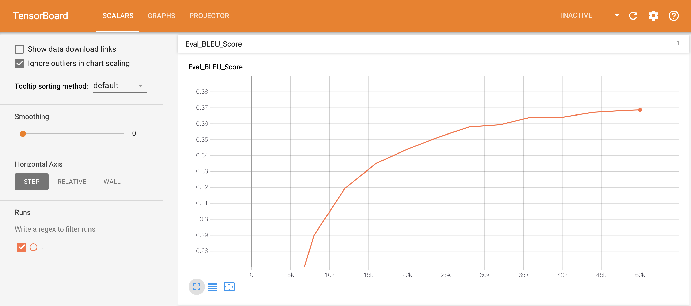
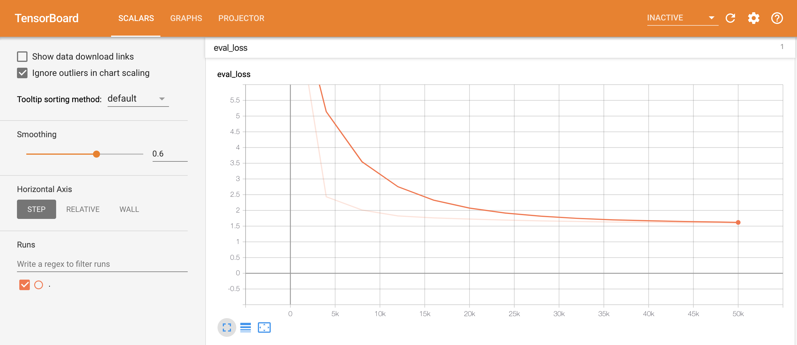
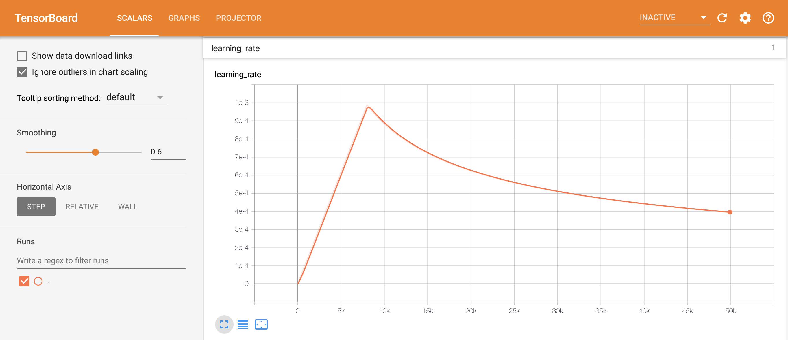
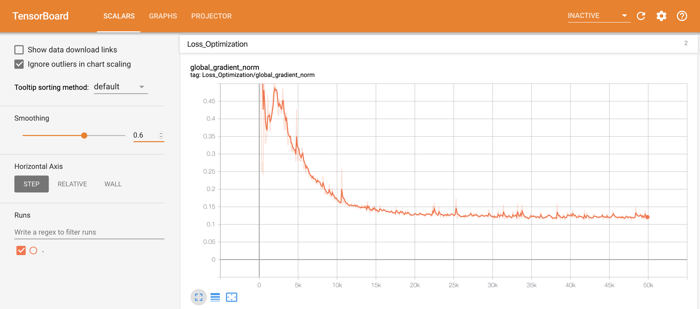

# Homework 9: Distributed Training and Neural Machine Translation

## Submission Answers

Please submit the nohup.out file along with screenshots of your Tensorboard indicating training progress (Blue score, eval loss) over time.  Also, answer the following (simple) questions:
* How long does it take to complete the training run? (hint: this session is on distributed training, so it *will* take a while)

I ran the training set on 50,000 steps, which took a total of 10h 39m 21s to run.

* Do you think your model is fully trained? How can you tell?

Yes, the model seems to be fully trained, or at least close, as the evaluation loss graph has begun to level off at approximately 1.6. This indicates that additional training will likely not reduce loss to a significant degree.

* Were you overfitting?

It seems that 50,000 steps was an adequate number for training. While the validation metrics such as BLEU Score and Evaluation Loss have begun to level off, they still improving and have not shown signs of reversing yet which would be a sign of overfitting.

* Were your GPUs fully utilized?

In line with the subsequent question, I do not have the specific results of GPU utilization. However, 

* Did you monitor network traffic (hint:  ```apt install nmon ```) ? Was network the bottleneck?

Unfortunately, I was not able to monitor the network traffic during the implementation. Through further research, however, network is indeed a common performance bottleneck in a distributed training process of this type. To address this bottleneck, network resources can be upgraded in the virtual machines to fully utilize GPUs.

* Take a look at the plot of the learning rate and then check the config file.  Can you explan this setting?

The plot of the learning rate increases linearly up until 8,000 steps before decreasing. In the config file there is a learning rate policy parameter called warmup_steps, which is set to 8,000. This parameter essentially waits to initialize the learning rate once the steps hit 8,000. The logic is that since the initial set of parameters in the model is random, and 

* How big was your training set (mb)? How many training lines did it contain?

The training "set" consisted of a number of different files (train, train.clean, train.clean.shuffled) for each language at varying sizes. Examples include: train.en (607 MB), train.de (678 MB), train.clean.en (593 MB), and train.clean.de (664 MB). There is also a file with both languages called train.clean.en-de.shuffled.common. It is the largest training file at 1.3 GB. The train.en and train.de files each contained 4,562,102 lines.

* What are the files that a TF checkpoint is comprised of?

A TF checkpoint is comprised of three files: a .data file, a .index file, and a .meta file. The .data file stores the values of each variable, the .index file identifies the checkpoint, and the .meta file stores the graph structure.

* How big is your resulting model checkpoint (mb)?

My resulting model checkpoint is 852.3 MB.

* Remember the definition of a "step". How long did an average step take?

The total training time was 10h 39m, or 639 minutes. Given that there were a total of 50,000 steps, that equates to 0.767 seconds per step. The number of objects per second averaged 81,363.

* How does that correlate with the observed network utilization between nodes?

The higher the network utilization, the lower the average step time.

### Validation BLEU Curve


### Evaluation Loss


### Learning Rate


### Loss Optimization

